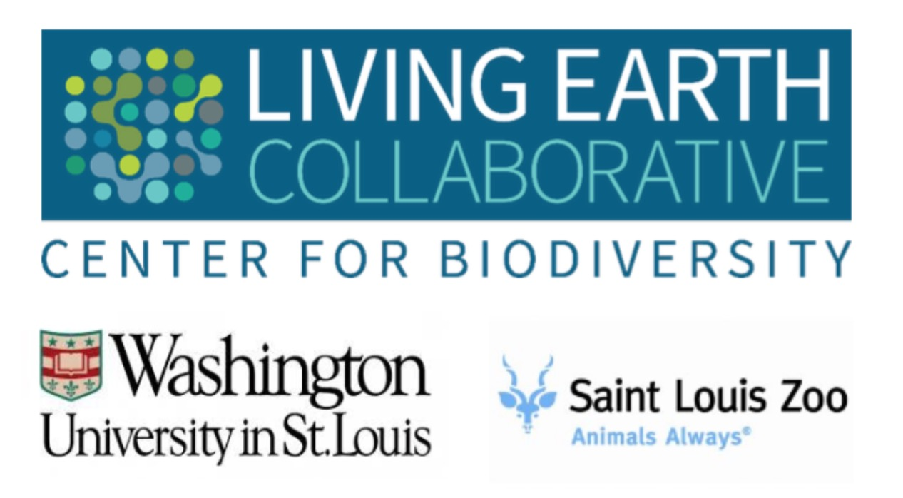

# Quantifying effects of parasites on ecosystem nutrient cycling  

    

**[Living Earth Collaborative Center for Biodiversity](https://livingearthcollaborative.wustl.edu/) Working Group**    
**Washington University**    
**St. Louis, MO, USA**       
**December 4-7, 2018**       

Participants:  
Amanda Koltz (co-organizer), Washington University in St. Louis, USA  
Rachel Penczkowski (co-organizer), Washington University in St. Louis, USA  
Sharon Deem (co-organizer), Institute for Conservation Medicine, St. Louis Zoo, USA  
Vanessa Ezenwa (co-organizer), University of Georgia, USA  
Susan Kutz, University of Calgary, Canada   
Brandon Barton, Mississippi State University, USA  
Zoe Johnson, Mississippi State University, USA  
Aimee Classen, University of Vermont, USA  
J. Trevor Vannatta, Purdue University, USA  
Matt Malishev, Emory University, USA  
David Civitello, Emory University, USA  
Daniel Preston, University of Wisconsin-Madison, USA  
Maris Brenn-White, St. Louis Zoo, USA    

## Overview    

Develop a predictive framework for estimating indirect effects of parasites on ecosystem nutrient cycling. Ideas behind this research were developed at the Living Earth Collaborative working group on the effects of parasites on ecosystem nutrient cycling, Washington University, St. Louis, MO, USA, December 4-7, 2018.      

## Instructions for running the model    

:one: Download `R` and `RStudio`.    
:two: [Download the model file (right click here and 'Save link as')](https://github.com/darwinanddavis/LECWorkingGroup/raw/master/NPSI.R) and run the simulation model in `RStudio`.  
:three: Follow the instructions at the beginning of the `R` file to run the model.        

## Troubleshooting  

All troubleshooting and bugs can be sent as a git issue or to matthew.malishev [at] emory.edu.     

## References  

## Maintainer  
**Matt Malishev**   
:mag: [Website](https://www.researchgate.net/profile/Matt_Malishev)    
:bird: [@darwinanddavis](https://twitter.com/darwinanddavis)  
:email: matthew.malishev [at] gmail.com    

