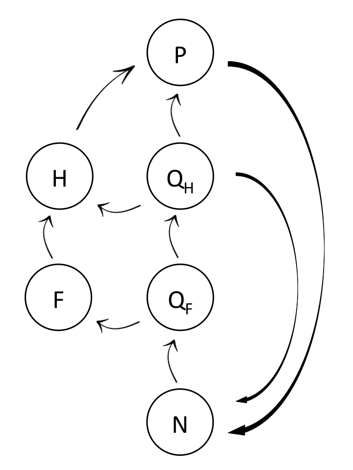

<script type="text/x-mathjax-config">
  MathJax.Hub.Config({ TeX: { equationNumbers: {autoNumber: "all"} } });
</script>

```{r echo = FALSE}
# library(rmarkdown)
# setwd("")
# f <- list.files()[1]
# render(f, output_format='pdf_document')
```

```{r, set-options, echo = FALSE, cache = FALSE}
options(width=100)
knitr::opts_chunk$set(
 eval = F, # run all code
 # echo = FALSE, # show code chunks in output 
 comment = "",
 tidy.opts=list(width.cutoff=100), # set width of code chunks in output
 tidy=TRUE, # make output as tidy
 message = FALSE,  # mask all messages
 warning = FALSE, # mask all warnings 
 size="small" # set code chunk size
)

# https://github.com/ucb-stat133/stat133-fall-2016/blob/master/hws/hw02-tables-ggplot.Rmd
knitr::opts_knit$set(root.dir=paste0(params$dir,"/")) # set working dir

setwd(paste0(params$dir,"/")) # for running just in R not knitr
```

\  

Date: `r params$date`  
`R` version: `r params$version`  
*Corresponding author: `r params$email`  

\newpage  

## Overview  

A disease transmission consumer-resource model for host populations exposed to and infected by gut parasites that tracks growth of food (autotrophs) in the environment, quantity (biomass) and quality (nutrient levels) of food consumed by hosts, within-host parasite biomass of infected host populations, and nutrient recycling back into the environment that is explicit in the ratio of carbon to total nutrient biomass.  

## Methods    

### Model description     

**State variables (units = nutrient biomass)**    
$N$ = nutrients in the landscape (biomass)    
$R$ = food in the landscape (food biomass)    
$Q_R$ = nutrient quota in food source (nutrient/carbon ratio)$Q_F \cdot$ is total nutrients in food.    
$H$ = host consumer population (host biomass)    
$Q_H$ = nutrient quota in hosts (nutrient/carbon ratio)    
$P$ = parasite population (within-host parasite biomass)    

**Parameters**  
$\alpha$ = virulence  
$d_H$ = death rate of hosts  
$d_P$ = death rate of parasites  
$l$ = nutrient loss  
$m_F$ = maximum food biomass   
$m_H$ maximum host biomass  
$\mu_M$ = maximum uptake rate of biomass    
$F$ = carbon biomass in food biomass  
$Q_R$ = nutrient to carbon $(\frac{N}{C})$ ratio in food biomass, so that $Q_R \cdot R$ is the nutrient level in food biomass.       

  


\newpage  

## State variable ODEs      

### Nutrient growth (biomass) (Eq. 1)  


$$
\frac
{dN}
{dt} = 
a - 
\mu_M(1 - \frac{m_F}{Q_F})FQ_F +
Recycling -
l
$$

\  
\  

where the $\mu_M(1 - \frac{m_F}{Q_F})$ term is the quota of nutrient uptake based on a functional uptake response.  

\  
\  

### Food growth (biomass) (Eq. 2)  

\  
\  

$$
\frac
{dF}
{dt} = 
\mu_MF(1 - 
  \frac
    {m_F}
    {Q_F}) -
      f F H
$$

\  
\  

### Nutrient quota of food source (Eq. 3)     

\  
\  

$$
\frac
{dQ_F}
{dt} = 
\mu_M N \text (??) -
  \mu_M Q_F(1 - \frac
    {m_F}
    {Q_F})
$$

\  
\  

### Host population growth (host biomass) (Eq. 4)    

\  
\  
 
$$
\frac
{dH}
{dt} = 
e Q_F f F H -
d_H H - 
\alpha P
$$

where $\alpha P$ is the virulence level.  

\  
\  
 
### Nutrient quota in hosts (nutrient/carbon ratio) (Eq. 5)   

\  
\  

$$
\frac
{dQ_H}
{dt} = 
e Q_F f F H - 
\mu_M Q_H (1 - \frac
  {m_H}
  {Q_H})
$$

The $e Q_F f F H$ term are the recycled nutrients feeding back into the $N$ biomass (Eq. 1).  

\  
\  

### Parasite population (within-host parasite biomass) (Eq. 6)    

\  
\  
 
$$
\frac
{dP}
{dt} =
e Q_H P H -
d_P P -
\alpha(\frac
  {P^2}
  {H})
  \cdot (\frac
    {k + 1}
    {k})
$$
  
The $e Q_H$ terms is for body tissue parasites. This term will change to $e Q_F$ if it becomes a gut parasite. The $\alpha(\frac{P^2}{H})\cdot (\frac{k + 1} {k})$ term is the virulence level.    

